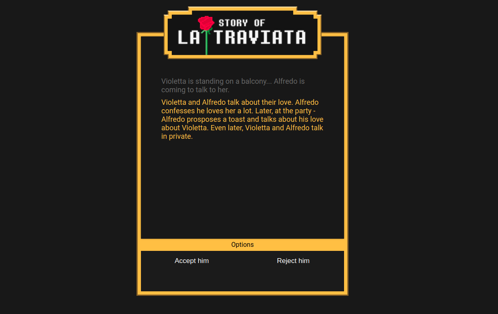
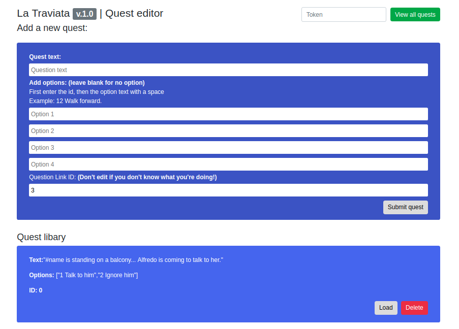

### La Traviata - Text Adventure

#### Text adventure game based on La traviata




#### Editor, built with Boostrap




#### How to play

 1. Install mysql (XAMPP with windows, or just ```sudo apt-get install mysql-server``` on linux)

 2. Import la_traviata.sql into a new database called la_traviata

 3. Host a PHP Server in the folder root.

 4. Enjoy


#### Exciting emit framework!

Thanks to my proprietary and revolutionary new framework - creating PHPxJavaScript applications has never been more simple nor fun! /s

##### Example (php): Sending from PHP to Client

```php
emit("all_quests" /* Call sign */, $row /* Variables */);
```

##### Example (js): Receiving from server on client

```javascript
on["all_quests" /* Call sign */] = response => {
    console.log(response);
}
```

##### Example (js): Sending it from Javascript to the server

```javascript
emit("a_string=value&an_int=23" /* Variables */, "editor.php" /* Destination */);
```

**If you want to use this framwork, clone php_handler.js for client and emit.php for the server.**

